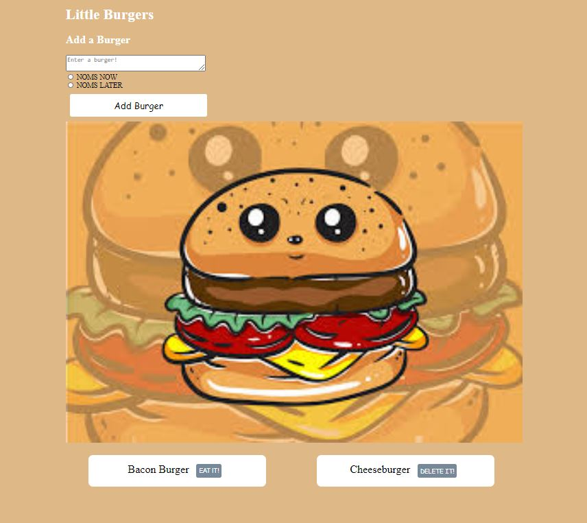

# Burger 

## Description
Tired of figuring out what burger you want to eat? The Burger application allows the user to enter a burger name and stores them to let the user decide whether they would
like to eat it now, or later.

Deployed App: https://hidden-bayou-53549.herokuapp.com/

Github Repository: https://github.com/mvanni4994

## Instructions
Once the application has been initialized, enter a burger in the text box and select whether you'd want to eat it now "NOMS NOW", or later "NOMS LATER". Once selected, hit the submit button and the burgers will be stored below the suspicious burger image below. If you ate it, you can select "DELETE IT!" to take it away from the list. If you're saving it for a special occasion, select "EAT IT!" when you're good and ready and it will transfer over to the "DELETE IT!" section.

## App Features

## Technology Used
npm i, Express, Express-handlebars, Heroku, Javascript, JQuery, Node, Sequal, HTML, CSS

## License

MIT License

Copyright (c) 2021 mvanni4994

Permission is hereby granted, free of charge, to any person obtaining a copy of this software and associated documentation files (the "Software"), to deal in the Software without restriction, including without limitation the rights to use, copy, modify, merge, publish, distribute, sublicense, and/or sell copies of the Software, and to permit persons to whom the Software is furnished to do so, subject to the following conditions:

The above copyright notice and this permission notice shall be included in all copies or substantial portions of the Software.

THE SOFTWARE IS PROVIDED "AS IS", WITHOUT WARRANTY OF ANY KIND, EXPRESS OR IMPLIED, INCLUDING BUT NOT LIMITED TO THE WARRANTIES OF MERCHANTABILITY, FITNESS FOR A PARTICULAR PURPOSE AND NONINFRINGEMENT. IN NO EVENT SHALL THE AUTHORS OR COPYRIGHT HOLDERS BE LIABLE FOR ANY CLAIM, DAMAGES OR OTHER LIABILITY, WHETHER IN AN ACTION OF CONTRACT, TORT OR OTHERWISE, ARISING FROM, OUT OF OR IN CONNECTION WITH THE SOFTWARE OR THE USE OR OTHER DEALINGS IN THE SOFTWARE.
